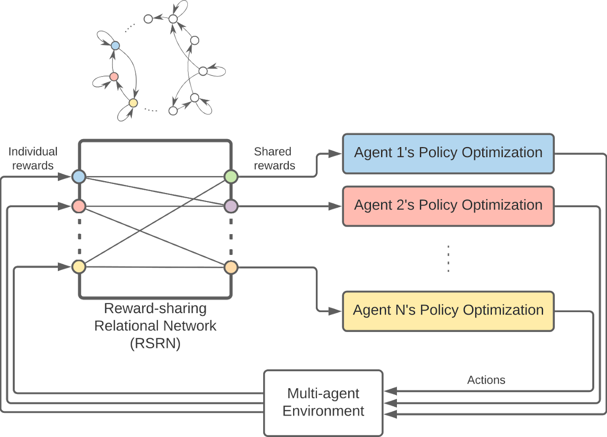

Reward-Sharing Relational Networks (RSRN) in Multi-Agent Reinforcement Learning (MARL)
======================================================================================

Introduction
------------

This repository contains the Python implementation of our work on integrating 'social' interactions in Multi-Agent Reinforcement Learning (MARL) setups through a user-defined relational network. The study aims to understand the impact of agent-agent relations on emergent behaviors using the concept of Reward-Sharing Relational Networks (RSRN).

    

Setup & Usage
-------------
EASY SETUP (recommended): Following the commands provided in /instructions/EC2_commands_ubuntu.txt should be enough to setup everything on your machine (Assuming Ubuntu 20.04 is installed).
1. Dependencies: This code is succesfully tested in Ubuntu 20.04 LTS. Since some of the required packages are outdated, setting up a virtual environment is highly recommended! Ensure you have all the necessary dependencies required by MPE and MADDPG installed. This can be done by checking out the readme in maddpg directory. The current code requires you to have a WandB account.
2. Training: To train the agents, cd into maddpg/experiments and run `python train_v3.py`. Use argument --exp-name to keep track of your experiment. Adjust the training parameters as required. The default parameters are the ones used in the paper.
3. Visualization: To visualize the behavior of the agents use --restore to load an already trained experiment and use --display to see the agent behaviors.
4. To have access to the already trained policies and data please use the /saved_policy/ directory available at
"[https://drive.google.com/drive/folders/16d0wSdxSdNZcQZx6ucAzEAQ9CmWuXMYF?usp=share_link](https://drive.google.com/drive/folders/16d0wSdxSdNZcQZx6ucAzEAQ9CmWuXMYF?usp=share_link)" and paste it into the /experiments/ directory.

Simulation and Scenario
-----------------------

We leverage the OpenAI's Multi-agent Particle Environment (MPE) for simulating an RSRN in a 3-agent MARL environment and also used OpenAI's MADDPG to train the agents. The agents' performance under different network structures is evaluated in this setting.

Environment Details:

- Framework: Multi-agent Particle Environment (MPE)
- Agents: Modeled as physical elastic objects
- State and Action Spaces: Continuous
- Policy Optimization: Integration of Relational Network and Multi-Agent Deep Deterministic Policy Gradient (MADDPG)
- Network Structure: 2 fully-connected 64-unit layers
- Learning Parameters: 
  - Learning Rate: 0.01
  - Batch Size: 2048
  - Discount Ratio: 0.95
  - Episode length: 70 Timesteps

Scenario Description:

Three agents aim to reach three unlabeled landmarks. Rewards are given upon reaching any landmark. This design makes the multi-agent environment intricate, thereby providing ample opportunities for emergent behaviors.

    

Cite Us
--------
If you find our work useful or use it in your research, please consider citing my thesis and our paper

- My MS thesis document available at:
https://www.proquest.com/docview/2920378989?sourcetype=Dissertations%20&%20Theses

- The original paper supporting this work is 'Reward-Sharing Relational Networks in Multi-Agent Reinforcement Learning as a Framework for Emergent Behavior' by Hossein Haeri, Reza Ahmadzadeh, and Kshitij Jerath published in International Conference on Autonomous Agents and Multiagent Systems (AAMAS 2021) - Adaptive and Learning Agents Workshop (ALA) available at:
https://arxiv.org/abs/2207.05886

- You can find more details on the project website: https://sites.google.com/view/marl-rsrn
https://drive.google.com/file/d/1LTxAY6wN31Quw7PeOfRqSNqlvunOlu0v/view?usp=sharing

- If you are using MADDPG or MPE, make sure to check the README in the MADDPG directory for how to cite their work and for more information.

